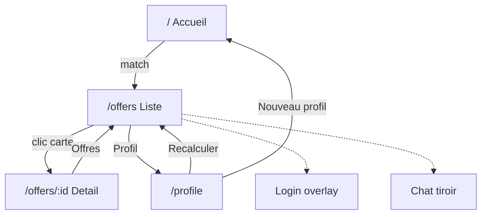

# Maquettes d'interface

Fil de fer de l'app (pas le design final). Home façon SuperCareer, suite
façon Jobbie : tout part d'un **profil**, pas d'une barre de recherche d'offres.

Invité d'abord, compte seulement pour **garder** le profil.

Ouvrir [index.html](index.html) en local pour tout voir d'un coup. Sur GitHub,
les SVG s'affichent directement ci-dessous.

## Navigation

Trait plein = démo. Pointillé = semaine 6, optionnel.

## Semaine 5

### 1. Accueil `/`

Logo + Se connecter. Zone texte (mini-CV) + PDF + 3 exemples.
Pas de bandeau Offres / Profil / Chat.

### 2. Liste `/offers`

Trois paniers. Nouveau profil sur cette page. Clic carte → détail.

### 3. Détail `/offers/:id`

Six dimensions, gaps, simulation. Retour ← Offres.

## Semaine 6

Bandeau : Offres · Profil · Chat. Login jamais bloquant.

### 4. Profil `/profile`

Corriger le Profile, Recalculer → liste.

### 5. Login (overlay)

Rattache le profil déjà en mémoire. Pas de re-dépôt du CV.

### 6. Chat (tiroir)

La page courante reste visible à gauche.

